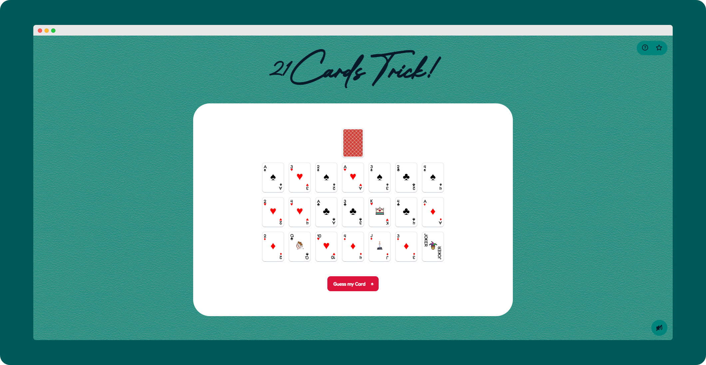

# [21-Cards-Trick!](https://praashoo7.github.io/21-Cards-Trick!/)

## How to Start?

  - At the first page choose a card in your mind. After choosing the card press "Guess my Card" button!
  - After this, on the Next page you will be asked "3" times to select the row in which your card is Present!
  - After the third selection the card in your mind will be revealed!

## Credits

  - BrotherSignature font from [FontSpace.](https://www.fontspace.com/brother-signature-font-f109627)
  - Images and Icons from [SVGRepo.](https://www.svgrepo.com/)
  - Sound Effects
      - [Big.mp3] from Microsoft Solitaire Collection.
      - [MIX.mp3] from [pixabay.](https://pixabay.com/sound-effects/)
      - [LAST.mp3] from [pixabay.](https://pixabay.com/sound-effects/)

    I have modified the sound effects to better align with my requirements!

## License

21-Cards-Trick! is open-source Software Licensed under the [MIT License](https://github.com/Praashoo7/21-Cards/blob/main/LICENSE)
